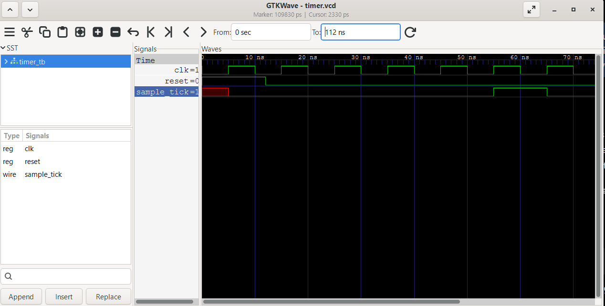

# fgpa-telemetry-controller

Small Verilog project to learn and demo RTL design, simulation, and verification fundamentals.

The first stage currently implements a synchronous sample timer that generates a one-clock-cycle pulse after a configurable number of clock cycles.

## Current functionality



- Synchronous counter-based timer
- Configurable sampling interval using a Verilog parameter
- One-cycle `sample_tick` output
- Synchronous reset
- Testbench-generated clock and reset signals
- Simulation with Icarus Verilog
- Waveform inspection using GTKWave

## Running the simulation

Requires [Icarus Verilog](http://iverilog.icarus.com/) and (optionally) [GTKWave](http://gtkwave.sourceforge.net/) for viewing waveforms.

Compile:

```bash
iverilog -g2012 -o sim rtl/timer.v tb/timer_tb.v
```

Run:

```bash
vvp sim
```

This produces `timer.vcd`. Open it in GTKWave to inspect the waveform:

```bash
gtkwave timer.vcd
```

## Next steps

- Add a UART transmit module so the timer actually drives outgoing data, not just an internal tick
- Tie the timer and UART together with a small controller FSM
- Target real hardware (iCE40 or similar) instead of simulation only
